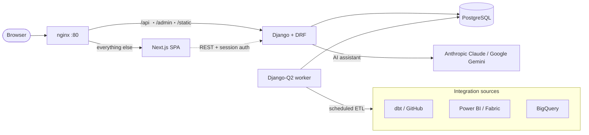

# DataGov Platform

> An open-source **data catalog & governance platform** that unifies your dbt, Power BI / Microsoft Fabric, and BigQuery assets into a single searchable catalog — with column-level lineage, an AI assistant, and a full governance workflow.

[](LICENSE)
[](https://www.python.org/)
[](https://www.djangoproject.com/)
[](https://nextjs.org/)
[](https://react.dev/)
[](https://www.typescriptlang.org/)
[](https://www.postgresql.org/)

A project by [**Welcome Pickups**](https://www.welcomepickups.com) x [**JustDataPlease**](https://justdataplease.com).

---

## What is DataGov Platform?

Modern data teams spread knowledge across dbt, BI tools, and the warehouse — and lose track of it. DataGov Platform pulls all of that into **one catalog** so anyone can answer: *What does this metric mean? Where does it come from? Who owns it? Is it still used?*

It connects to your existing stack, extracts metadata on a schedule, stitches it together into a cross-tool lineage graph, and puts a governance layer (owners, tasks, status, departments) and an AI assistant on top.

### Highlights

- 📚 **Unified catalog & data dictionary** — search, filter, sort, and paginate across every connected tool from one place.
- 🔗 **Column-level lineage** — an interactive [React Flow](https://reactflow.dev/) graph that traces a single column through dbt models *and* into Power BI measures, visuals, pages, and reports. Cross-tool "bridge" edges connect dbt ↔ Power BI. See [docs/lineage.md](docs/lineage.md).
- 🤖 **AI assistant** — chat with your catalog in natural language (a configurable LLM — Anthropic Claude by default, Google Gemini also supported — via `pydantic-ai`), answered asynchronously by a background worker.
- 🧹 **Cleanup & insights** — surface unused Power BI assets and stale dbt models, rank top assets, and track report usage.
- 🗺️ **Metrics Map** — a draw.io / Miro-style visual canvas for designing metric and relationship maps, fed straight from the catalog.
- 🛡️ **Governance** — owners ("Champions"), departments, categories, governance tasks, and full status-change history.
- 👥 **Multi-org & RBAC** — multiple organizations with per-org admins and page-level access control.
- 🔌 **Pluggable integrations** — scheduled ETL runs (cron), full-pipeline workflows, run logs, GCS raw export, and Slack notifications.

## Integrations

| Source | What it ingests |
|---|---|
| **dbt** (via GitHub) | Models, sources, tests, descriptions, and compiled SQL → column-level lineage (parsed with [`sqlglot`](https://github.com/tobymao/sqlglot)) |
| **Power BI / Microsoft Fabric** | Semantic models, tables, columns, measures (DAX), reports, pages, visuals, and usage |
| **Google BigQuery** | Warehouse table & schema metadata |
| **Slack** | OAuth app for events and governance alerts |

> Sources are pluggable: each one is a self-contained class in [`backend/app/etl/sources/registry.py`](backend/app/etl/sources/registry.py). Adding a new integration is three steps — subclass `BaseSource`, register it, and the views, tasks, and management commands pick it up automatically.

## Architecture



- **Frontend** — Next.js 15 (App Router) + React 19 + TypeScript, Tailwind, Radix UI, TanStack Query, React Flow (`@xyflow/react`) + dagre for graphs, Recharts.
- **Backend** — Django 6 + Django REST Framework, Django-Q2 for background tasks and cron, `pydantic-ai` (Anthropic Claude by default, Google Gemini supported) for the assistant, `sqlglot` + `dbt-artifacts-parser` for lineage.
- **Data** — PostgreSQL 18.
- **Infra** — Docker Compose with nginx as a single entrypoint routing `/api`, `/admin`, `/static`, `/media` → Django and everything else → Next.js.

## Quick start (Docker)

**Prerequisites:** Docker + Docker Compose.

```bash
# 1. Configure the backend (copy the sample and fill in your values)
cp backend/.env.sample backend/.env

# 2. Start the local database
docker compose up -d db

# 3. (Optional) seed it from an existing production database — see docs below
pwsh scripts/seed-local-db.ps1

# 4. Build and start the whole stack
docker compose up --build
```

Then open <http://localhost>. nginx serves the SPA and proxies the API; ETL writes only ever touch your **local** database.

> 💡 To run the ETL safely against a copy of production data, see [docs/local-development.md](docs/local-development.md).

## Local development

Run the two apps separately (the frontend proxies `/api/*` to Django):

```bash
# Backend (from backend/app)
python -m venv .venv && source .venv/bin/activate   # Windows: .venv\Scripts\activate
pip install -r requirements.txt
python manage.py migrate
python manage.py runserver 8000

# Frontend (from frontend/)
npm install
npm run dev          # http://localhost:3000, proxies /api -> :8000
```

Auth uses the Django session: the SPA calls `GET /api/me/`, `POST /api/auth/login/`, and `POST /api/auth/logout/`. Because Next proxies `/api/*`, the session and CSRF cookies flow on one origin — no CORS setup needed.

### Frontend scripts

| Script | Description |
|---|---|
| `npm run dev` | Dev server on :3000 |
| `npm run build` | Production build |
| `npm run typecheck` | `tsc --noEmit` |
| `npm test` | Vitest unit tests |

## Configuration

Backend configuration lives in `backend/.env` (start from [`backend/.env.sample`](backend/.env.sample)):

| Variable | Purpose |
|---|---|
| `SECRET_KEY` | Django secret key |
| `DEBUG` | `True` for local development |
| `DJANGO_ALLOWED_HOSTS` | Comma-separated allowed hosts |
| `GEMINI_API_KEY` | Google Gemini key for the AI assistant |
| `MCP_TOKEN` | Token for the catalog MCP/tooling layer |
| `SLACK_CLIENT_ID` / `SLACK_CLIENT_SECRET` | Slack OAuth app credentials |
| `DB_HOST` / `DB_PORT` / `DB_NAME` / `DB_USER` / `DB_PASSWORD` | PostgreSQL connection |
| `SUPERUSER_EMAIL` / `SUPERUSER_PASSWORD` | Bootstrap admin account |

## Project structure

```
datagov_platform/
├── backend/                # Django + DRF API, ETL, workers
│   └── app/
│       ├── catalog/        # core app: models, views, serializers, services, AI chat, Slack
│       ├── config/         # Django settings / ASGI / WSGI
│       └── etl/sources/    # pluggable integration sources (dbt, fabric, registry)
├── frontend/               # Next.js 15 SPA
│   ├── app/                # App Router routes (catalog, lineage, chat, powerbi, dbt, …)
│   ├── components/         # UI primitives, layout, lineage graph, metrics canvas
│   └── lib/                # typed API client, auth/query providers, pure lineage logic
├── docs/                   # additional documentation
├── scripts/                # operational scripts (e.g. local DB seeding)
├── docker-compose.yml      # full-stack orchestration
└── nginx.conf              # reverse-proxy routing
```

## Documentation

Full developer documentation lives in [`docs/`](docs/) ([index](docs/README.md)):

- [Architecture](docs/architecture.md) — services, routing, request/auth flow, background tasks, configuration & environment.
- [Local development](docs/local-development.md) — running the stack, seeding a local DB from production, tests.
- [Database schema](docs/database.md) — the data model, model by model.
- [ETL & integrations](docs/etl.md) — sources, the transform/load pipeline, the full workflow, destinations, scheduling, Slack alerts.
- [Lineage](docs/lineage.md) — column-level lineage, the dbt ↔ Power BI bridge, and the React Flow explorer.
- [AI assistant](docs/assistant.md) — the async pydantic-ai agent, model selection, tools, and guardrails.
- [Governance & access control](docs/governance.md) — ownership, status workflow, tasks, audit trail, and the access model.
- [REST API](docs/api.md) — the `/api/` endpoint reference.
- [Frontend](docs/frontend.md) — the Next.js SPA architecture.

## Contributing

Contributions are welcome! To get started:

1. Fork the repo and create a feature branch.
2. Make your change, keeping it consistent with the surrounding code style.
3. Run the test suites (`pytest` in the backend, `npm test` + `npm run typecheck` in the frontend).
4. Open a pull request describing the change and the reasoning behind it.

Please open an issue first for larger changes so we can discuss the approach.

## Maintainers & contributors

Built and maintained by **JustDataPlease** and **Welcome Pickups**:

- Jason Tragakis
- Konstadinos Karagiannis
- Ilias Xenogiannis
- Panagiotis Ntarzanos
- Dora Andreadi
- Alexandros Plexidas
- Giorgos Korkidis
- Orestis Kompougias
- Vasilis Sokolakis

## License

Released under the [MIT License](LICENSE).

## Acknowledgements

The lineage experience takes design inspiration from [dbt-colibri](https://github.com/dbt-labs) and the dbt and Power BI ecosystems. Thanks to the maintainers of the open-source projects this platform builds on.
