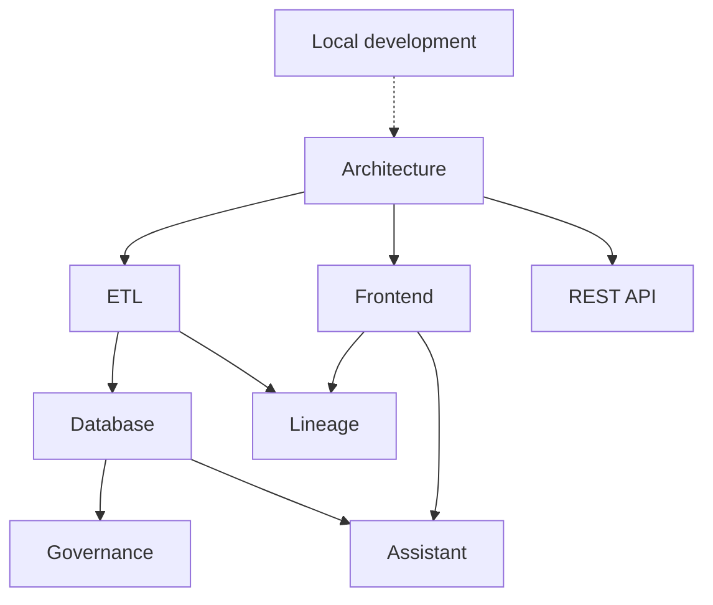

# Documentation

Developer documentation for the **DataGov Platform** — an open-source data catalog
& governance platform that unifies dbt, Power BI / Microsoft Fabric, and BigQuery
metadata into one searchable catalog with column-level lineage, an AI assistant,
and a governance workflow.

Start with the [project README](../README.md) for the product overview and quick
start, then dive into the area you need below.

## Contents

| Doc | What it covers |
|---|---|
| [Architecture](architecture.md) | Services, nginx routing, request/auth flow, background tasks, caching, configuration & environment variables |
| [Local development](local-development.md) | Running the stack, seeding a local DB from production, tests, management commands |
| [Database schema](database.md) | The data model — every Django model, grouped by concern |
| [ETL & integrations](etl.md) | Sources (dbt, Power BI/Fabric), the transform/load pipeline, the full workflow, destinations, scheduling, Slack alerts |
| [Lineage](lineage.md) | Column-level lineage: sqlglot parsing, dbt↔Power BI bridges, edge classification, and the React Flow explorer |
| [AI assistant](assistant.md) | The async pydantic-ai agent, model selection, tools, feature flags, and safety guardrails |
| [Governance & access control](governance.md) | Ownership, status workflow, tasks, audit trail, and the per-page access model |
| [REST API](api.md) | Endpoint reference for the `/api/` surface |
| [Frontend](frontend.md) | The Next.js SPA: routing, the typed API client, auth, data fetching, and feature modules |

## How the pieces relate

A typical first read: **Architecture** → **Local development** → then the
subsystem you're working on.
