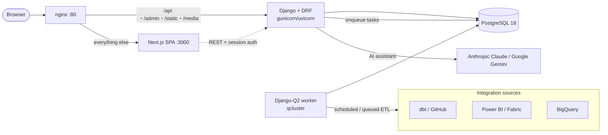

# Architecture

How the DataGov Platform is put together — the processes, how they talk to each
other, how requests flow, and how configuration drives behaviour.

For a feature-by-feature breakdown see the sibling docs:
[ETL & integrations](etl.md), [Database schema](database.md),
[Lineage](lineage.md), [AI assistant](assistant.md),
[Governance & access control](governance.md), [REST API](api.md),
[Frontend](frontend.md).

---

## The big picture

Five processes run as Docker Compose services (see
[`docker-compose.yml`](../docker-compose.yml)):

| Service | Image / build | Role |
|---|---|---|
| `nginx` | `nginx:1.25-alpine` | Single entrypoint on `:80`. Routes `/api`, `/admin`, `/static`, `/media` → Django; everything else → Next.js. |
| `web` | `./backend` | Django REST API served by gunicorn + the uvicorn worker class (`config.asgi`). |
| `worker` | `./backend` | `python manage.py qcluster` — the Django-Q2 background-task cluster. Runs ETL, the AI assistant, and scheduled jobs. |
| `frontend` | `./frontend` | Next.js 15 standalone server (App Router SPA) on `:3000`. |
| `db` | `postgres:18` | PostgreSQL. One database backs the app, the task queue, and the cache. |

`web` and `worker` are **the same image** running different commands. They share
the database and the cache, so the worker can publish progress (e.g. live chat
status) that the web process reads back.

---

## nginx routing

[`nginx.conf`](../nginx.conf) keeps the whole app on **one origin**, which is
what lets Django session + CSRF cookies flow without any CORS setup.

- `/api/` → `web:8000`, with `proxy_buffering off` so long/streamed chatbot
  responses flush immediately.
- `/admin/` → `web:8000` (Django admin).
- `/static/` → served directly from the `static_volume` (Django/DRF/admin assets
  collected by `collectstatic`).
- `/media/` → `web:8000`.
- `/` (everything else, including `/_next/*`) → `frontend:3000`.

Two production-hardening details worth knowing:

- `resolver 127.0.0.11 valid=10s` re-resolves `web`/`frontend` via Docker's
  embedded DNS every 10s, so `docker compose up --build` (which hands containers
  new IPs) doesn't strand nginx on a stale IP and 502.
- `client_max_body_size 10m` — the default 1m would 413 governance CSV imports
  for larger catalogs.

---

## Request & auth flow

Auth is **Django session-based** — there are no tokens in JavaScript.

1. The SPA calls `GET /api/me/` on load to discover the current user and their
   per-page permissions ([access control](governance.md#access-control)).
2. Login is `POST /api/auth/login/`; logout is `POST /api/auth/logout/`.
3. Because Next.js proxies `/api/*` to Django (in dev via
   [`next.config.ts`](../frontend/next.config.ts) rewrites; in prod via nginx),
   the browser only ever talks to one origin, so the `sessionid` and `csrftoken`
   cookies just work.
4. Unsafe requests (POST/PUT/PATCH/DELETE) send `X-CSRFToken` read from the
   `csrftoken` cookie — required by DRF's `SessionAuthentication`. The typed API
   client ([`frontend/lib/api.ts`](../frontend/lib/api.ts)) does this
   automatically.

`config/urls.py` mounts `admin/` and `api/` (which includes
[`catalog/urls.py`](../backend/app/catalog/urls.py)). The classic
server-rendered frontend was removed — the React app is the only UI. See the
[REST API reference](api.md).

A custom auth backend ([`catalog/backends.py`](../backend/app/catalog/backends.py),
`EmailOrUsernameModelBackend`) lets users sign in with either email or username.
`UserActivityMiddleware` records logins/logouts/pageviews into `UserActivityLog`.

---

## Background tasks (Django-Q2)

Anything slow runs off the request thread on the `worker` process. The cluster is
configured in [`settings.py`](../backend/app/config/settings.py) `Q_CLUSTER`:

- `workers: 4`, `timeout: 3600` (heavy Fabric extractions can take ~30 min),
  `retry: 3700` (deliberately greater than `timeout` so a still-running task is
  never re-queued as a duplicate), `orm: 'default'` (the queue is stored in
  Postgres — no Redis/broker needed).

Used by:

- **ETL** — `run_source_task`, `run_destination_task`, `run_workflow_task`
  ([ETL doc](etl.md)).
- **AI assistant** — each question is answered by `run_chat_event_sync` on the
  worker; the web request returns a `task_id` immediately and the SPA polls for
  the result ([assistant doc](assistant.md)).
- **Schedules** — cron-driven source/destination/workflow runs.

The **Queues** admin page (`/settings/queues`) surfaces the live queue and lets
admins kill stuck tasks.

---

## Caching

`CACHES` uses Django's **DatabaseCache** (table `django_cache_table`), not
LocMemCache. This is deliberate: the cache must be shared across OS processes so
the `worker` can write chat-status updates that the `web` process reads. The
entrypoint runs `createcachetable` on boot. Default TTL is 600s.

The cache carries: live chat status strings, the per-session chat lock, the
chat-task→session mapping, the assistant's front-loaded context bundles
(10-min TTL), and cooperative-cancel flags for ETL runs.

---

## Configuration & environment

Backend config is environment-driven, loaded from `backend/.env` by
[`settings.py`](../backend/app/config/settings.py) (via `python-dotenv`). Start
from [`backend/.env.sample`](../backend/.env.sample).

### `DEBUG` selects the database target

This is the single most important setting to understand:

| `DEBUG` | Database | Cookies |
|---|---|---|
| `True` | **Local** Docker Postgres (`DB_*`, host defaults to `db`), `sslmode=disable` | Non-secure (works over `http://localhost`) |
| `False` | **Production** Azure Postgres (`PROD_DB_*`), `sslmode=require` | Secure (HTTPS only), unless `SECURE_COOKIES=False` |

> ⚠️ With `DEBUG=False` the running app — **including every ETL write** — talks to
> production. Use `DEBUG=True` for all local work. To run a production-like stack
> (`DEBUG=False` + Postgres) over plain `http://localhost`, set
> `SECURE_COOKIES=False` so the session cookie is still sent. See
> [Local development](local-development.md).

### Key variables

| Variable | Purpose |
|---|---|
| `SECRET_KEY` | Django secret key |
| `DEBUG` | `True` for local dev (also selects the local DB — see above) |
| `DJANGO_ALLOWED_HOSTS` | Comma-separated allowed hosts; each is also added to `CSRF_TRUSTED_ORIGINS` |
| `SECURE_COOKIES` | Override secure-cookie behaviour (defaults to `not DEBUG`) |
| `ANTHROPIC_API_KEY` | Anthropic key — the default assistant provider is Claude |
| `GEMINI_API_KEY` | Google Gemini key (still supported as an assistant provider) |
| `SLACK_CLIENT_ID` / `SLACK_CLIENT_SECRET` | Slack OAuth app credentials |
| `DB_HOST` / `DB_PORT` / `DB_NAME` / `DB_USER` / `DB_PASSWORD` | Local PostgreSQL connection (`DEBUG=True`) |
| `PROD_DB_*` | Production PostgreSQL connection (`DEBUG=False`, and the seed script) |
| `DB_SSLMODE` / `PROD_DB_SSLMODE` | Override per-target SSL mode |
| `SUPERUSER_EMAIL` / `SUPERUSER_PASSWORD` | Bootstrap admin account |

> Notes: `MCP_TOKEN` appears in `.env.sample` but is **not read** anywhere in the
> backend — there is no MCP server in this app. `ANTHROPIC_API_KEY` is not in the
> sample file (it predates the Claude migration); add it manually. Integration
> credentials (Power BI client secret, dbt GitHub token, BigQuery service
> account) are stored **per `IntegrationSource`/`IntegrationDestination` row in
> the database**, configured in the Integrations UI — not in `.env`.

The frontend reads one variable, `NEXT_PUBLIC_API_URL` (see
[`frontend/.env.local.example`](../frontend/.env.local.example)) — the in-network
fallback for Next's server-side rewrites. Browser traffic reaches `/api` on the
same origin through nginx and never uses this value.

---

## Tech stack

- **Frontend** — Next.js 15 (App Router), React 19, TypeScript 5, Tailwind 3,
  Radix UI, TanStack Query 5, React Flow (`@xyflow/react`) + dagre, Recharts,
  react-markdown. Tests with Vitest.
- **Backend** — Django 6 + Django REST Framework, Django-Q2 (background tasks &
  cron), `pydantic-ai` for the assistant, `sqlglot` + `dbt-artifacts-parser` for
  dbt lineage, `google-cloud-bigquery` / `google-cloud-storage`, `slack_sdk`.
  Tests with pytest / pytest-django. Full list:
  [`backend/requirements.txt`](../backend/requirements.txt).
- **Data** — PostgreSQL 18 (app data, the Django-Q queue, and the cache).
- **Infra** — Docker Compose, nginx, WhiteNoise for static files, gunicorn +
  uvicorn worker.

---

## Boot sequence

The backend image entrypoint ([`backend/entrypoint.sh`](../backend/entrypoint.sh))
runs on every `web` start: `migrate` → `createcachetable` → `collectstatic` →
launch gunicorn (uvicorn worker, 300s timeout) on `:8000`. The `worker` service
overrides the command with `qcluster`. `db` exposes a healthcheck so `web` and
`worker` wait until Postgres is accepting connections.
