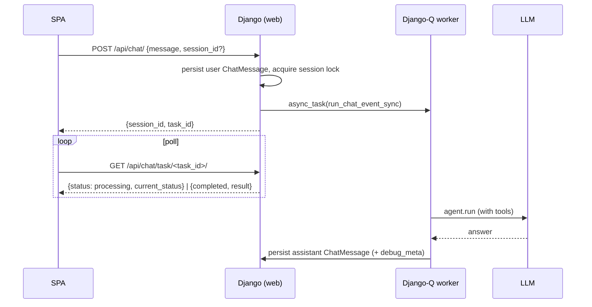

# AI assistant

A natural-language chat over your catalog. It's built on
[`pydantic-ai`](https://ai.pydantic.dev/), answers run **asynchronously on the
Django-Q2 worker**, and — when enabled — it can run live read-only queries
against BigQuery and Power BI.

> **Provider:** the default model is **Google Gemini**
> (`google:gemini-3.5-flash`), set by `DEFAULT_CHATBOT_MODEL` in
> [`tools/agent.py`](../backend/app/catalog/tools/agent.py). Anthropic Claude is
> still supported. The model is org-configurable via the `ChatbotModel` table —
> its `identifier` is passed verbatim to `Agent(model=...)`. Set
> `GEMINI_API_KEY` / `ANTHROPIC_API_KEY` in the environment; pydantic-ai resolves
> them from `os.environ` directly.

The code is split across
[`catalog/tools/`](../backend/app/catalog/tools/) (agent + tools),
[`catalog/views.py`](../backend/app/catalog/views.py) (chat endpoints + worker),
and the live-query clients
[`powerbi_tools.py`](../backend/app/catalog/powerbi_tools.py) /
[`bigquery_tools.py`](../backend/app/catalog/bigquery_tools.py).

---

## Request flow

1. **`POST /api/chat/`** (`chat_api_view`) resolves or creates a `ChatSession`,
   persists the user's `ChatMessage`, acquires a per-session cache lock (a second
   concurrent question for the same session gets **HTTP 409**), enqueues
   `run_chat_event_sync` on Django-Q, and returns `{session_id, task_id}`
   immediately.
2. **The worker** (`run_chat_event_sync`, module-level so Django-Q can import it)
   rebuilds the conversation history from prior `ChatMessage` rows, builds the
   agent for the org, runs it, and persists the assistant reply.
3. **The SPA polls** `GET /api/chat/task/<task_id>/` until `completed`, then
   fetches `GET /api/chat/sessions/<id>/messages/`. While the task runs, the
   worker writes a human-readable status string to the cache (e.g. "Querying
   Power BI…") that the poll surfaces as a live "thinking" bubble.

### Timeouts & resilience

Three layers, sized so they nest cleanly:

- **Per-question timeout** — `org.chat_timeout_seconds` (default 180) enforced by
  running the agent in a single-worker `ThreadPoolExecutor` and abandoning it on
  `TimeoutError`.
- **Django-Q hard timeout** — `chat_timeout + 30`, the backstop kill.
- **Session lock TTL** — sized above both so it never releases early.
- **Transient LLM retry** — `ModelHTTPError` with status 429 or ≥500 is retried
  with a `(10, 20)`s backoff.

---

## How the agent is built

`get_agent(...)` / `build_chatbot_agent_for_org(...)` in
[`tools/agent.py`](../backend/app/catalog/tools/agent.py) assemble a pydantic-ai
`Agent`. The design is deliberately **context-first, tool-light**: rather than
giving the model search tools, the relevant slice of the catalog is **front-loaded
into the system prompt**.

- **Model** — `org.chatbot_model.identifier` if active, else
  `DEFAULT_CHATBOT_MODEL`. `model_settings` pins `temperature=0` for determinism,
  except for newer Anthropic models that reject sampling params (it returns `{}`
  to avoid a 400).
- **System prompt** ([`tools/prompts.py`](../backend/app/catalog/tools/prompts.py))
  starts from `SYSTEM_PROMPT_BASE` and appends, per enabled integration: a
  front-loaded **context block** (the catalog dump), a provider **addendum**, and
  the provider's **tools**. Live providers also get an authoritative current-date
  block and a strict output-format reminder (every live result must lead with a
  bold header + a Quick Stats table + a result table).
- **Front-loaded context scope** comes from the org:
  `assistant_powerbi_workspace_ids` (empty = all workspaces) and
  `assistant_bigquery_dataset_ids` (empty = none — BigQuery schema is fetched
  live, so a dataset must be selected). Configured on the **Org Settings** page.

---

## Tools & feature flags

Providers live in
[`tools/assistant/`](../backend/app/catalog/tools/assistant/) with a uniform
`scope_options` / `build_context` / `build_tools` contract. Each integration has a
**catalog tier** (read-only) and, where live execution exists, a **live tier** —
see [`assistant-prompts-and-tools.md`](./assistant-prompts-and-tools.md) for the
exact prompt text and front-loaded context per case. **Only the PowerBI catalog
tier defaults ON**; every other tier is opt-in (default OFF). Each tier is an
`Organization` flag:

| Flag | Tier | Default | Front-loaded context | Tool(s) registered |
|---|---|---|---|---|
| `powerbi_tools_enabled` | Power BI catalog | **ON** | deduped measures + reports + tables, scoped to workspaces | `get_pb_item_details`, `get_pb_usage_analytics` |
| `powerbi_live_tools_enabled` | Power BI live | OFF | — | `powerbi_run_dax_query` |
| `dbt_tools_enabled` | dbt catalog | OFF | every model + columns, with FQN/materialization | `get_dbt_item_details` |
| `bigquery_tools_enabled` | BigQuery catalog | OFF | live schema for the selected datasets (read-only) | — (no execution) |
| `bigquery_live_tools_enabled` | BigQuery live | OFF | — | `bigquery_execute_query` |

Always registered (no flag): `get_lineage` — a rare one-hop neighbour check on an
exact name ([`tools/lineage.py`](../backend/app/catalog/tools/lineage.py)). There
is **no** search/resolve tool: name resolution reads the front-loaded listing.
(`find_path_between_entities` still exists in that module but is not registered.)

- **`get_pb_item_details`** ([`tools/lineage.py`](../backend/app/catalog/tools/lineage.py))
  returns one Markdown bundle for a PowerBI measure / table / column / report /
  workspace: definition (DAX), home/fact/dimension tables and their columns,
  relationships (with `USERELATIONSHIP` extraction), owner, description, usage
  stats, and full **Uses** / **Used by** lineage — one call covers "what is X",
  "how is X built", "who owns X", and "where is X used". A measure name typically
  recurs across datasets (one source + its DirectQuery `EXTERNALMEASURE`
  re-exports) that all share one **`ItemGroup`**, so the lookup collapses the
  name-matched copies onto the group's curated **`primary_item`**; the ambiguity
  gate only fires when a name genuinely spans **multiple groups**.
- **`get_pb_usage_analytics`** ([`tools/analytics.py`](../backend/app/catalog/tools/analytics.py))
  returns the whole measure↔report usage map in one call from precomputed data:
  pass `report_name` (measures in a report), `measure_name` (reports using a
  measure), or neither (catalog-wide overview); optional `workspace` substring.
  This is what answers "top measures in the Ops reports" without profiling
  one-by-one.
- **`get_dbt_item_details`** ([`tools/lineage.py`](../backend/app/catalog/tools/lineage.py))
  returns a dbt model's full depth — FQN, columns, SQL, materialization, upstream
  tree (with BigQuery FQNs) and downstream consumers, plus ownership/usage — in
  one call.
- **`powerbi_run_dax_query`** ([`powerbi_tools.py`](../backend/app/catalog/powerbi_tools.py))
  runs live DAX. Guardrails: must start `EVALUATE`, single statement, no
  placeholder names, and `DATE(year,…)` literals are confined to {last, this,
  next} year (anti-hallucination). Mutating tools (create measure/column) are
  implemented but **not registered** — the assistant cannot modify Power BI.
- **`bigquery_execute_query`** ([`bigquery_tools.py`](../backend/app/catalog/bigquery_tools.py))
  runs read-only SQL: leading `SELECT`/`WITH` only, DML/DDL/admin blocked, single
  statement, a mandatory dry-run that rejects scans over 1 GB, and results capped
  at 50 rows.

**`make_safe_tool`** ([`safe_wrapper.py`](../backend/app/catalog/tools/safe_wrapper.py))
wraps every tool so the model receives a structured `{status: success|error, …}`
dict instead of a raw exception, and fires the before/after hooks that drive the
live status bubble and the `debug_meta` telemetry.

### Debug output

`debug_meta` (per-tool calls, args, timings, generated DAX/SQL) is **always**
persisted to `ChatMessage`. The `debug_responses_enabled` org flag only controls
whether that section is *also* appended to the visible answer.

---

## What's dormant

`PbLiveQueryThread`, `ChatSession.langgraph_thread_id`, and the
`plan`/`awaiting_pick`/`awaiting_plan_confirm` stages are **scaffolding that is
not wired into the live chat path**. The active assistant is a single stateless
`agent.run` per turn; disambiguation is handled inside the tools (they return
candidate lists and the user replies in natural language, with conversation
history carrying context). There is no MCP server — `MCP_TOKEN` in `.env.sample`
is unused.

---

## Testing from the CLI

`python manage.py chat_repl [--org-id N] [--seed "..."] [--once]
[--force-powerbi] [--force-bigquery] [--force-dbt]` runs an interactive REPL
against the same `get_agent` the web view uses, printing each tool call. The
`--force-*` flags bypass the org enable flags. REPL commands: `:reset`, `:help`,
`:quit`.

The assistant is also reachable from **Slack** via
[`slack_views.py`](../backend/app/catalog/slack_views.py), which drives the same
agent on an async path.
