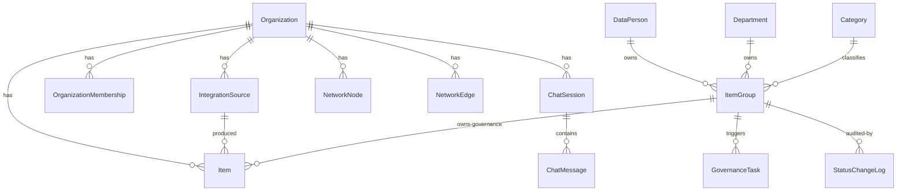

# Database schema

The data model for the catalog. Every model lives in
[`backend/app/catalog/models.py`](../backend/app/catalog/models.py); the database
is PostgreSQL 18 and the schema is managed by Django migrations
(`catalog/migrations/`). `AUTH_USER_MODEL` is `catalog.CustomUser`.

This document groups the models by concern. For how the ETL writes them see
[ETL & integrations](etl.md); for the governance semantics see
[Governance](governance.md); for the lineage graph tables see [Lineage](lineage.md).

---

## Core catalog

### `Item`
The central table — one row per catalogued asset across every tool. The
`item_id` (a string, max 2000 chars) is the **primary key**: a deterministic
hash so re-running the ETL upserts rather than duplicates.

`item_type` distinguishes the asset kind. Power BI / Fabric: `PB_WORKSPACE`,
`PB_TABLE`, `PB_COLUMN`, `PB_MEASURE`, `PB_REPORT`, `PB_PAGE`, `PB_VISUAL`,
`PB_FIELD`. dbt: `DBT_WORKSPACE`, `DBT_SOURCE`, `DBT_MODEL`, `DBT_SEED`,
`DBT_COLUMN`, `DBT_TEST`. `service` records the producing tool (`'dbt'`,
Power BI, …).

Notable column groups:

- **Hierarchy** — `workspace_id/name`, `dataset_id/name`, `table_name`.
- **Attributes** — `datatype`, `column_type`, `expression` (raw DAX / SQL),
  `compiled_expression` (dbt manifest `compiled_code`, shown in the lineage
  panel's Raw/Compiled toggle), `properties_yaml` (a dbt node's `schema.yml`
  block, shown in the YAML tab), `formatstring`.
- **Usage stats** — `is_unused`, plus `connected_reports/pages/visuals/measures/
  columns/tables` counts and `connected_reports_json` (downstream reports for a
  measure/column). Computed by the ETL transform and the workflow final step.
- **Bridge keys** — dbt side: `database_name`, `schema_name`, `alias`; Power BI
  side: `bq_project`, `bq_schema`, `bq_source_name` (the BigQuery FQN parsed out
  of the M-query). These let the [bridge matcher](lineage.md) join dbt models to
  Power BI tables on FQN. `is_related` / `relationships_json` capture
  semantic-model relationships.
- **Source linkage** — `organization` and `integration_source` FKs (the
  `IntegrationSource` that produced the row).
- **Catch-all** — `tags` (JSON), `meta` (JSON: dbt meta, constraints, loader,
  access level, …).
- **Soft-delete** — `deleted` (bool) + `deleted_at`. ETL never hard-deletes; an
  item missing from a new run is flagged `deleted=True`, preserving history.
- **Governance mirror** — `status` is a denormalized copy of
  `ItemGroup.status` (kept in lockstep so item-level views and the BigQuery
  export can filter without a join). `group_id` is the measure-grouping key.

> **Governance does not live on `Item`.** Owner / steward / category / status /
> custom description live on **`ItemGroup`**. `Item` exposes read-only `@property`
> proxies (`ownership_person`, `steward`, `category`, `custom_description`, …) so
> legacy read sites keep working; **all writes go through the ItemGroup API.**

`ItemManager.create(...)` still accepts the old governance kwargs and transparently
routes them onto the item's `ItemGroup` (created on demand), so older callers and
tests keep working. The ETL bypasses this path (raw SQL + `ensure_item_groups`).

### `ItemGroup`
Owns the governance for one or more items. Two `kind`s:

- **`measure_name`** — every `PB_MEASURE` instance sharing a name (and
  `Item.group_id`, formatted `"{org_id or 0}::{lower(trim(name))}"`) collapses
  into **one** group, so a measure's owner/steward/status is curated once and
  shared across all its instances across datasets/workspaces.
- **`singleton`** — every non-measure item gets its own 1-item group, so "every
  item has a group" and all code reads governance uniformly.

Carries the real governance columns: `ownership_department`, `ownership_person`,
`steward`, `category`, `status`, `custom_description`, plus `deleted`/`deleted_at`
(a group-level soft delete that cascades down to its items) and `primary_item`
(which item supplies the group's default workspace/dataset/DAX). `group_key` is
the unique natural key (`item::{item_id}` for singletons, the measure key for
measure groups).

### `Category`, `Department`, `DataPerson`
- **`Category`** — org-scoped classification label for item groups.
- **`Department`** — org-scoped org unit; an item group can be owned by a department.
- **`DataPerson`** — a person who can own or steward catalog items, deliberately
  **decoupled from `CustomUser`** so stakeholders without a login are still
  addressable. Optional `user` FK links to a login when one exists. Role flags
  `is_owner` / `is_steward` / `is_other` control which dropdown the person appears
  in; `departments` is M2M; `slack_handle` (must start with `@`) is used to tag
  people in Slack alerts.

### `Summary`
A small denormalized roll-up (total/unused measures & columns, total reports)
recomputed by the workflow final step for the dashboard.

---

## Governance & audit

### `GovernanceTask`
A small actionable task for a data person, created automatically when an
`ItemGroup` status flips to `ATTENTION` or `DELETED`. Routed to the asset's
steward when one exists (else unassigned). `assignee_role` records *why* the
person was picked so routing can grow (owner/other) without a schema change.
Dedup rule: at most one **open** task per group. `state` is `open`/`done`. See
[Governance](governance.md).

### `StatusChangeLog`
Append-only audit trail of `ItemGroup` status transitions — one row per change
(`old_status` → `new_status`, `changed_by`, `changed_at`), written from the same
sites that fire Slack alerts and create tasks. `group_key` is denormalized so a
row stays readable after its group is deleted.

`Item.STATUS_CHOICES` — `UNVERIFIED` (default), `VERIFIED`, `DELETED`,
`ATTENTION` — is shared by `Item`, `ItemGroup`, `GovernanceTask.trigger_status`,
and `StatusChangeLog`.

---

## Lineage graph

### `NetworkNode`
One row per graph node. `node_id` (PK) is `"{TYPE}::{hash}"` where `TYPE` is
`TABLE/COLUMN/MEASURE/REPORT/PAGE/VISUAL/FIELD` (and the dbt equivalents) and the
hash is the same MD5 used by `Item.item_id` for catalog-resident types — so most
nodes join 1:1 to an `Item`. `group` and `name` drive the graph UI.

### `NetworkEdge`
One directed edge (`source` → `target`, unique together). Persisted
classification columns (the single source of truth is
[`services/network_classify.py`](../backend/app/catalog/services/network_classify.py)):

- `kind` — `contains` | `column` | `model` | `join` | `filter`.
- `level` — `asset` | `column` (which lineage view the edge belongs to).
- `lineage_type` — for column edges, how the target was derived:
  `pass-through` | `rename` | `transformation`.
- `bridge_reason` — set only on cross-tool bridge edges: `bq_fqn`,
  `name_full`, or `name_tail` (how a dbt node was matched to a Power BI node).

See [Lineage](lineage.md) for how these are built.

---

## Power BI usage analytics

### `PowerBIReportUsage`
Per `(workspace, report, user, month, platform, distribution, page)` view counts,
pulled from each workspace's *Report Usage Metrics Model* via DAX. Truncated and
reloaded each ETL run with the most recent N months (default 3). `report_id`
joins to `Item.item_id` via the same hash. Backs the **Data Champions** and
**Report Health & Usage** pages and is exported to BigQuery.

---

## AI assistant

### `ChatbotModel`
Catalogue of selectable LLMs. `identifier` is passed **verbatim** to
pydantic-ai's `Agent(model=...)` (e.g. `anthropic:claude-opus-4-8`,
`google:gemini-...`); `display_name` shows in the UI; `is_active`/`sort_order`
control availability and ordering.

### `ChatSession` / `ChatMessage`
A chat thread (owned by a user) and its messages. `ChatMessage.role` is
`user`/`assistant`; `content` is the text; `debug_meta` (JSON) always stores
per-tool telemetry regardless of the org's debug-display toggle.
`ChatSession.langgraph_thread_id` is dormant scaffolding.

### `PbLiveQueryThread`
Dormant scaffolding for a multi-step Power BI query flow (stages
`plan`/`awaiting_pick`/…). **Not wired into the live chat path** — the active
assistant is a single stateless agent run per turn. See [Assistant](assistant.md).

---

## Organizations, membership & multi-tenancy

### `Organization`
The tenant. Almost everything is org-scoped via an `organization` FK. Beyond
branding (`name`, `primary_color`, `icon`) it carries the assistant configuration:

- Feature flags: `powerbi_tools_enabled`, `bigquery_tools_enabled`,
  `dbt_tools_enabled`, `debug_responses_enabled`.
- `show_deleted_items` — whether ETL-soft-deleted items still appear in views.
- `chatbot_model` FK (which LLM to use).
- Assistant context scope: `assistant_powerbi_workspace_ids` (empty = all),
  `assistant_bigquery_dataset_ids` (empty = none — must be selected).
- `chat_timeout_seconds` (default 180).
- `slack_bot_token` (legacy; the canonical Slack config is on `IntegrationHook`).

### `OrganizationMembership`
Joins a user to an org with an `is_admin` flag. **Org-admin is per-org**, stored
here — not a global Django group. See [access control](governance.md#access-control).

### `CustomUser`
`AbstractUser` with `email` as the unique `USERNAME_FIELD`. `default_workspaces`
(JSON) stores a per-source default Power BI workspace, used by the chatbot scope
and the lineage workspace pre-select.

### `UserActivityLog`
Login / logout / failed-login / pageview audit, written by
`UserActivityMiddleware`. Captures `email` separately so failed logins (no user)
and deleted users stay searchable.

---

## Integrations

These tables back the Integrations UI; the ETL doc explains how they drive runs.

| Model | Purpose |
|---|---|
| `IntegrationSource` | A configured source (`source_type`: `powerbi_fabric`, `dbt`, …) with its credentials (Power BI tenant/client/secret/workspaces; dbt GitHub repo/token/branch/manifest path). `category` (`transformation`/`visualization`) sets pipeline ordering. |
| `SourceSchedule` | One-to-one cron schedule for a source (`manual`/`daily`/`weekly`/`custom`). |
| `SourceRunLog` | One row per source run: `running` → `success`/`failed`, captured `log_output`, `triggered_by`. |
| `IntegrationDestination` | An export target (`bigquery`) with project/dataset/service-account JSON. |
| `DestinationSchedule` / `DestinationRunLog` | Schedule + run history for destinations. |
| `IntegrationHook` | A Slack hook (`slack` / `slack_alerts`) with bot token and channels. |
| `WorkflowRun` | One end-to-end pipeline execution: stages `init` → `sources` → `final` → `destinations`, with status + `log_output`. |
| `WorkflowSchedule` | One-to-one cron schedule for the full workflow (per org). |
| `WorkflowRawExport` | Per-org toggle to zip each source's raw extracted files to GCS after extraction. |

---

## Metrics Map

### `MetricsMap`
Backs the **Metrics Map** tool. `kind='scratchpad'` rows hold a list of metric
definitions in `metrics` (JSON), each round-tripping to/from YAML. `kind='canvas'`
rows leave `metrics` empty and store a full draw.io-style diagram document
(nodes/edges/groups/viewport) in `graph`. Org-scoped, with `created_by`.

---

## Conventions

- **Org scoping** — nearly every table has a nullable `organization` FK
  (`on_delete=SET_NULL` for catalog data so deleting an org doesn't cascade away
  history; `CASCADE` for integration config). Queries filter by the user's
  resolved org.
- **Soft delete** — `deleted` / `deleted_at` on `Item` and `ItemGroup`; rows are
  preserved for history and hidden from views unless `show_deleted_items` is on.
- **Indexes** — `Item` is heavily indexed for the catalog/dashboard query
  patterns (org × service × type × deleted composites); see the `Meta.indexes`
  block in `models.py`.
- **Migrations** — the schema's evolution is the migration history; a few notable
  ones: `0022` (owner → data person), `0028`/`0029` (consolidate access groups,
  move governance to `ItemGroup`), `0036` (add Claude models, repoint orgs off
  Gemini), `0044`/`0048` (edge classification columns).
