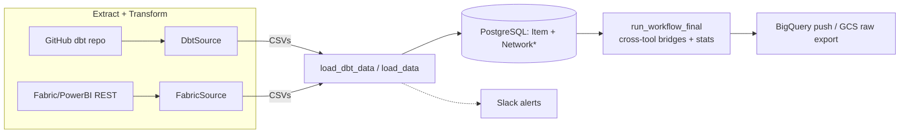

# ETL & integrations

How metadata gets from your tools into the catalog. The ETL layer lives in
[`backend/app/etl/`](../backend/app/etl/) (the pluggable sources, destinations,
and hooks) and [`backend/app/catalog/integration_tasks.py`](../backend/app/catalog/integration_tasks.py)
(the orchestration that runs on the Django-Q2 worker).



The pipeline is a classic **extract → transform → load**, then a **final**
cross-tool stitch, then optional **destinations**.

---

## The source abstraction

Every source is a self-contained class extending `BaseSource` in
[`etl/sources/registry.py`](../backend/app/etl/sources/registry.py). The registry
maps a `source_type` to its class:

```python
SOURCE_REGISTRY = {'powerbi_fabric': FabricSource, 'dbt': DbtSource}
def get_source(source_model) -> BaseSource: ...   # raises ValueError if unknown
```

A source implements:

| Member | Role |
|---|---|
| `from_model(cls, source)` | Build an instance from an `IntegrationSource` row. |
| `test(self) -> dict` | Lightweight connectivity check (no data stored). Returns `{"status": "ok"\|"fail", "lines": [...]}`. |
| `extract(self, etl_dir, log)` | Full extract **and** transform; writes CSVs into `etl_dir/data/`. |
| `load_command` | The Django management command that loads those CSVs into the DB (`load_data` or `load_dbt_data`). |
| `category` | `transformation` or `visualization` — pipeline ordering (see [Workflow](#the-full-pipeline-workflow)). |
| `get_etl_dir()` / `get_raw_dirs()` | Working directory and which raw folders the GCS export should capture. |

**Adding a source is three steps:** subclass `BaseSource`, implement
`test`/`extract`/`from_model`, and add it to `SOURCE_REGISTRY`. The views, tasks,
and management commands pick it up automatically. (The `IntegrationSource` model
declares more `source_type` choices — `postgresql`, `mysql`, `snowflake`,
`csv_upload` — but only `dbt` and `powerbi_fabric` have classes today.)

Destinations mirror this: `BaseDestination` in
[`etl/destinations/registry.py`](../backend/app/etl/destinations/registry.py),
with `DESTINATION_REGISTRY = {'bigquery': BigQueryDestination}`.

---

## dbt source

[`etl/sources/dbt/`](../backend/app/etl/sources/dbt/). `DbtSource` is a
`transformation` source loaded by `load_dbt_data`.

**Extract** ([`extract_dbt.py`](../backend/app/etl/sources/dbt/extract_dbt.py)):

1. Shallow-clones the GitHub repo (`git clone --depth 1 --branch <branch>`,
   300s timeout, the PAT embedded in the URL and scrubbed from any error output,
   `GIT_TERMINAL_PROMPT=0` so a bad token fails fast).
2. Locates `manifest.json` at the configured `dbt_manifest_path` (default
   `target/manifest.json`), auto-discovering it if absent (preferring a
   `/target/` path).
3. Locates the optional `catalog.json` (produced by `dbt docs generate`) — used
   for real warehouse column types.
4. Runs `transform_dbt.main(...)`.

**Transform** ([`transform_dbt.py`](../backend/app/etl/sources/dbt/transform_dbt.py)):
parses the manifest (+ optional catalog, both validated with
`dbt-artifacts-parser`) and writes `dbt_info_items.csv` + `dbt_info_graph.csv`.
It emits these item types:

- `DBT_WORKSPACE` (one per project), `DBT_SOURCE`, `DBT_MODEL` / `DBT_SEED`,
  `DBT_COLUMN`, `DBT_TEST`.
- For models/seeds it captures raw SQL (from the repo file, falling back to
  `raw_code`), `compiled_code` → `compiled_expression`, materialization, and the
  node's `schema.yml` block serialized to `properties_yaml`.
- It populates the bridge keys (`database_name`, `schema_name`, `alias`) and
  merges manifest + catalog column metadata.

**Column-level lineage** is the slow, interesting part — compiled SQL is parsed
with `sqlglot` to derive `DBT_COLUMN → DBT_COLUMN` edges, each tagged with a
`lineage_type`. This is covered in depth in the [Lineage doc](lineage.md).

---

## Power BI / Microsoft Fabric source

[`etl/sources/fabric/`](../backend/app/etl/sources/fabric/). `FabricSource` is a
`visualization` source loaded by `load_data`.

**Extract** ([`extract_fabric.py`](../backend/app/etl/sources/fabric/extract_fabric.py)):

1. Authenticates to Azure AD (client-credentials grant, scope
   `https://analysis.windows.net/powerbi/api/.default`).
2. For each workspace, lists `SemanticModel` and `Report` items from the **Fabric
   REST API** and downloads each item's definition via `getDefinition` (handling
   the 202-async polling, decoding the base64 TMDL/JSON `parts` into
   `raw_fabric_definitions/`).
3. Runs [usage extraction](#power-bi-report-usage) (best-effort).
4. Runs `transform_fabric.main(...)`.

**Transform** ([`transform_fabric.py`](../backend/app/etl/sources/fabric/transform_fabric.py))
walks the downloaded definitions and produces the unified `fabric_info_items.csv`
plus `fabric_info_graph.csv`. It:

- Parses **reports** (legacy `report.json` *and* the PBIR folder format —
  `pages/<id>/page.json`, `visuals/<id>/visual.json`), extracting used fields per
  visual, page/visual titles, and `web_url`.
- Parses **semantic models** (`model.bim` or TMDL `tables/*.tmdl`): tables,
  columns (data vs calculated), measures (DAX + format string), partitions, and
  the **BigQuery source FQN** out of the M-query (`bq_project/bq_schema/
  bq_source_name`) — the preferred key for the dbt bridge. It also parses
  `relationships.tmdl` (cardinality / cross-filter / active).
- Parses **DAX dependencies** (measure → measure/column references) into edges.
- Emits item types `PB_WORKSPACE`, `PB_TABLE`, `PB_COLUMN`, `PB_MEASURE`,
  `PB_REPORT`, `PB_PAGE`, `PB_VISUAL`, `PB_FIELD` and a producer→consumer graph
  (field → visual → page → report; table → columns/measures; FK→PK relationships
  tagged `kind='join'`).
- Computes usage: `is_unused` per asset, and via topological propagation the
  `connected_*` counts and `connected_reports_json` downstream-report lists.

### Power BI report usage

[`extract_usage.py`](../backend/app/etl/sources/fabric/extract_usage.py) queries
each workspace's *Report Usage Metrics Model* via the Power BI REST
`executeQueries` endpoint with three DAX queries (views, reports, users), joins
them by GUID in Python, aggregates to monthly grain, and writes
`fabric_info_usage.csv`. Loaded into `PowerBIReportUsage` as a **full replace**
scoped to `(organization, integration_source)` each run (the source's built-in
retention is only ~30 days, so it always re-pulls the most recent N months,
default 3).

> Note: [`powerbi_client.py`](../backend/app/catalog/powerbi_client.py) is a
> separate synchronous REST client used by the **AI assistant**, not the ETL
> extractor.

---

## Loading into the database

The `load_data` (Power BI) and `load_dbt_data` (dbt) management commands
(`catalog/management/commands/`) load the transform CSVs. Both use Postgres
`COPY` into temp tables, then `INSERT … ON CONFLICT (item_id) DO UPDATE` —
idempotent upserts keyed on `item_id`.

- **User/governance fields are never overwritten.** Owner / steward / status /
  category / custom description live on `ItemGroup` and are untouched by ETL.
  `load_dbt_data` additionally `COALESCE`s name/description/expression so a sparse
  re-run doesn't blank existing values.
- **Soft delete** — items present in the DB but absent from the new run are set
  `deleted=True` (scoped so dbt and Power BI don't clobber each other). Nothing is
  ever hard-deleted; downstream queries filter `deleted=False`.
- **Domain isolation** — `load_dbt_data` only touches `service='dbt'` rows;
  `load_data` rebuilds the non-dbt network data. Both delete cross-tool bridge
  edges, which the [final step](#the-full-pipeline-workflow) rebuilds.
- Edge `kind`/`level` are computed in SQL by
  [`network_classify.py`](../backend/app/catalog/services/network_classify.py),
  the single source of truth shared with the bridge builder.

---

## Running a single source

`run_source_task(source_id, triggered_by)` in
[`integration_tasks.py`](../backend/app/catalog/integration_tasks.py) is the
Django-Q2 task:

1. Find/create a `running` `SourceRunLog`.
2. `get_source(source).extract(...)` (extract + transform).
3. `call_command(src.load_command, ...)` (load).
4. Mark the run `success` (or `failed` on exception/cancel).

A throttled "live-flush" logger persists `log_output` to the DB at most every 2s
so the Integrations UI shows progress during long runs. The `finally` block
stamps `finished_at`, updates `SourceSchedule.last_run_at`, cleans up local ETL
files, prunes run logs older than 10 days, and sends a Slack alert.

**Cooperative cancellation** is cache-flag based (`source_cancel_{id}`): the API
sets the flag, and checkpoints between major steps raise `TaskCancelled` (a step
already in flight finishes first). Same pattern for destinations and workflows.

**From the CLI:** `python manage.py run_source <source_id> [--triggered-by ...]`
runs the task synchronously. `python manage.py test_sources [--source-id N]` runs
each active source's `test()` without storing data.

---

## The full-pipeline workflow

`run_workflow_task` runs everything end to end, tracked by a `WorkflowRun` through
four stages:

1. **`init`** — gather active sources, destinations, and the raw-export config.
2. **`sources`** — run each active source sequentially (extract → optional GCS
   raw export → load), each with its own `SourceRunLog` and Slack alert.
3. **`final`** — `call_command('run_workflow_final', ...)`.
4. **`destinations`** — push each active destination, each with a
   `DestinationRunLog` and Slack alert.

**Transformation before visualization.** Sources are ordered by `category`
(`transformation` = 0, `visualization` = 1, then by name). The warehouse must be
reshaped before the BI tools that read it. There's a hard barrier: **if any
transformation source fails, the entire visualization stage is skipped** (those
sources get result `skipped`) — running BI extracts on stale warehouse data
would mask problems.

### The final step

[`run_workflow_final.py`](../backend/app/catalog/management/commands/run_workflow_final.py)
runs only after all sources have loaded (it needs both dbt and Power BI data
present):

1. **Cross-tool bridges (dbt ↔ Power BI)** via `build_cross_tool_bridges`
   ([`services/bridge_builder.py`](../backend/app/catalog/services/bridge_builder.py)) —
   matches dbt models to Power BI tables FQN-first, falling back to name matching,
   and writes table- and column-level bridge edges. See [Lineage](lineage.md).
2. **Backfill dbt usage stats** — walks the now-merged graph (bridges included)
   and sets `is_unused` / `connected_reports` on dbt models/seeds/sources.
3. **Recompute `Summary`** for the dashboard.

The whole run is finalized in a `finally` block: local files cleaned up,
`log_output` persisted, `WorkflowSchedule.last_run_at` updated, workflow runs
older than 30 days pruned. Final status is `failed` if any source failed, else
`success`.

You can re-run **only** the bridging step (e.g. after fixing a dbt manifest or a
Power BI source binding) without a full ETL re-run:
`python manage.py rebridge [--organization-id N]`.

---

## Destinations

### BigQuery
[`push_to_bigquery.py`](../backend/app/etl/destinations/bigquery/push_to_bigquery.py)
exports the catalog to BigQuery (location `EU`). The mode used by tasks pulls from
the Django ORM and writes two tables with `WRITE_TRUNCATE`:

- **`catalog_items`** — from `Item`, annotated with the governance fields pulled
  through the `item_group` relation.
- **`catalog_powerbireportusage`** — from `PowerBIReportUsage`.

`run_destination_task` and the workflow both call it; it has its own
`DestinationRunLog`, cancellation, and Slack alert.

### GCS raw export
[`gcs/raw_export.py`](../backend/app/etl/destinations/gcs/raw_export.py). When the
org's `WorkflowRawExport` is active, each source's `get_raw_dirs()` are zipped
in-memory and uploaded to
`gs://{bucket}/raw/{org}/{source}/{source}_{timestamp}.zip` — one zip per source
per run. The archive layout lets you extract it back into `etl_dir` to replay the
transform offline. **Only the workflow** triggers this, not standalone source runs.

---

## Slack alerts

[`etl/hooks/slack/slack_alerts.py`](../backend/app/etl/hooks/slack/slack_alerts.py).
All functions look up an active `IntegrationHook` of type `slack_alerts`, require
a bot token, post to `slack_alerts_channel` (falling back to `slack_channel`), and
are wrapped so a Slack failure never breaks a run:

- `send_slack_alert` — after every source run (✅/❌, name, trigger, duration).
- `send_slack_dest_alert` — after a destination push.
- `send_slack_item_alert` — on an item status change (🔔) or delete (🗑️), with an
  "Open in Power BI" link.
- `send_slack_task_alert` — a new/updated governance task (📋), tagging the
  assignee via their `slack_handle`.

The item/task alerts are fired from the governance code paths, not the ETL tasks.

---

## Scheduling

Each `IntegrationSource`, `IntegrationDestination`, and the per-org workflow has a
one-to-one schedule row (`SourceSchedule` / `DestinationSchedule` /
`WorkflowSchedule`) with a `frequency` (`manual` / `daily` / `weekly` / `custom`)
and a `cron_expression`. Django-Q2 (with `croniter`) fires the corresponding
`*_scheduled` entrypoint, which creates the run-log/`WorkflowRun` row and invokes
the task. `last_run_at` is updated after each run.

---

## Timeouts, retention & gotchas

- **Timeouts**: dbt git clone 300s; Fabric auth/list 15s; usage DAX 180s; the
  Django-Q task timeout is 3600s (heavy Fabric extractions can take ~30 min).
- **No automatic retries** in the extractors themselves (the Django-Q `retry`
  setting governs task-level re-queue, set above `timeout` to avoid duplicates).
- **Retention**: source/destination run logs pruned after 10 days; workflow runs
  after 30 days; local ETL files removed after every run.
- **Known sharp edge**: the Fabric `getDefinition` 202-async poll has no
  max-iteration cap — a Fabric operation stuck in a non-terminal state could loop.
