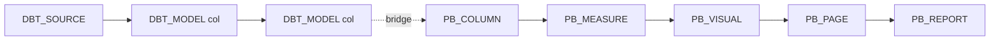

# Column-level lineage

The lineage feature traces a single column through dbt models **and** into
Power BI measures, visuals, pages, and reports — with cross-tool "bridge" edges
connecting dbt ↔ Power BI. This doc covers both the backend (how the graph is
built) and the frontend (how it's rendered and explored).

---

## Part A — building the graph (backend)

The graph lives in two tables, [`NetworkNode` and `NetworkEdge`](database.md#lineage-graph).
Node ids are `"{TYPE}::{hash}"`, where the hash matches `Item.item_id` for
catalog-resident types, so a node joins 1:1 to its catalog item.

### dbt column lineage with sqlglot

[`etl/sources/dbt/column_lineage.py`](../backend/app/etl/sources/dbt/column_lineage.py)
turns each model's compiled SQL into `DBT_COLUMN → DBT_COLUMN` edges. It is pure
Python (no Django) and defensive — a single unparseable model or column is counted
and skipped, never fatal.

1. **SQL source resolution** (`resolve_sql`): prefer the manifest's
   `compiled_code` (dbt already expanded `ref()`/`source()`/macros). Fall back to
   a "compiler-lite" that regex-substitutes `{{ ref() }}` / `{{ source() }}` /
   `{{ this }}` and strips `{{ config() }}` against the node's `depends_on`. If
   any unresolved Jinja remains, the model is skipped rather than mis-parsed.
2. **Relation index** (`build_relation_index`): maps a relation name → dbt
   `unique_id`, indexing 3-part names always and 2-part names only when
   unambiguous, so a bare `schema.table` can't match the wrong schema.
3. **sqlglot schema** (`build_schema`): a nested `{db:{schema:{table:{col:type}}}}`
   built from `catalog.json` so `SELECT *` expands to real columns.
4. **Edge extraction** (`extract_column_edges`): for each output column, call
   `sqlglot.lineage(col, sql, schema, dialect='bigquery')`, walk the tree, keep
   `Table` sources, resolve each to a producer `unique_id`, and emit an edge that
   reuses the exact `DBT_COLUMN` item-ids (so ids match existing nodes).

**`lineage_type`** classifies each column edge (`_classify_lineage_type`):

| Value | Meaning |
|---|---|
| `pass-through` | plain column reference, or an alias whose name matches the source |
| `rename` | an alias over a column with a different name |
| `transformation` | any other expression (function, arithmetic, CASE…), **or** any column fed by 2+ upstream columns |
| `unknown` | the projection couldn't be resolved |

Because each model's compiled SQL references only its direct upstreams, the
per-model edges chain into a full project-wide column DAG once every model is
processed. This is the slowest part of the dbt transform (minutes on large
projects — it emits `[CLL]` heartbeat lines).

### Cross-tool bridge edges (dbt ↔ Power BI)

The dbt and Power BI graphs are stitched together by the
[workflow final step](etl.md#the-final-step), which calls
`build_cross_tool_bridges`
([`services/bridge_builder.py`](../backend/app/catalog/services/bridge_builder.py)).
The matching logic is in
[`services/bridge_matching.py`](../backend/app/catalog/services/bridge_matching.py)
(pure Python, unit-tested).

A Power BI table carries the BigQuery FQN triple `(bq_project, bq_schema,
bq_source_name)`; a dbt model carries the equivalent `(database, schema, alias)`
(falling back to splitting the legacy `table_name`). Matching is **FQN-first**,
then by name, and each bridge edge records *why* it matched in `bridge_reason`:

| `bridge_reason` | Rule |
|---|---|
| `bq_fqn` | exactly one dbt model's FQN triple equals the Power BI table's FQN |
| `name_full` | Power BI table name == dbt `table_name` (unique) |
| `name_tail` | Power BI name == the last dotted segment of dbt `table_name` (unique) |

Ambiguous (≥2 candidates) or zero matches → no bridge. For a matched table pair,
columns are matched case-insensitively by name to produce column-level bridge
edges (`DBT_COLUMN → PB_COLUMN`, hardcoded `lineage_type='pass-through'`). The
builder first deletes stale bridge edges, then upserts the new nodes/edges.

`build_cross_tool_bridges` returns `{table_bridges, column_bridges, by_reason}`.
Run it in isolation with `python manage.py rebridge [--organization-id N]`.

### Edge classification

[`services/network_classify.py`](../backend/app/catalog/services/network_classify.py)
is the single source of truth for an edge's `kind` and `level`, persisted as
indexed columns so the asset/column views filter in SQL instead of re-deriving
from node-id prefixes:

- **`kind`** — `contains` (container→member), `column` (column↔column, measure→
  column, the cross-tool bridge), `model` (model↔model, source→model, report
  hierarchy, table-level bridge), plus `join`/`filter` for relationships.
- **`level`** — `asset`, `column`, or `both` (`both` lets measures appear in both
  views — they hinge the structural and derivation graphs).

`classify_edge(source_type, target_type)` and the matching `kind_case_sql` /
`level_case_sql` (used by the COPY-based loaders) must stay in lockstep — they
both derive from the same module constants.

### Graph traversal services

- [`services/network_path.py`](../backend/app/catalog/services/network_path.py) —
  generic shortest-path BFS over `NetworkEdge` backing `/api/network/path/`:
  `find_shortest_path` returns the union of all shortest paths (capped at 50),
  honouring `direction` and a `workspace_id` constraint; `find_reachable_nodes`
  populates the path "Start" dropdown; `resolve_node_id_by_name` resolves
  free-form names for chatbot tools.
- [`services/graph_paths.py`](../backend/app/catalog/services/graph_paths.py) —
  answers "is dimension D usable with measure M?" by finding a TMDL-relationship
  path within one dataset, reporting the cardinality chain and inactive hops
  (so the assistant refuses live DAX unless `USERELATIONSHIP` is used).

---

## Part B — exploring the graph (frontend)

The lineage explorer lives in
[`frontend/components/lineage/`](../frontend/components/lineage/) and the pure
graph logic in [`frontend/lib/lineage/`](../frontend/lib/lineage/). It's a React
Flow (`@xyflow/react`) graph rendered from the network API — a from-scratch
reimplementation of the [dbt-colibri](https://github.com/dbt-labs) concepts driven
by the platform's own cross-tool network.

### Data flow

State is a single `useReducer` ([`lineage-store.ts`](../frontend/components/lineage/lineage-store.ts));
the derived React Flow nodes/edges are computed in `useMemo` and never stored, so
they can't drift from the raw graph.

1. **Focus** an element (sidebar tree or `?node_id=` deep link) → load just that
   card (`api.network.ego({node_id, depth: 0, direction})`).
2. **Build** — `buildColibriFlow(rawNodes, rawEdges, centerId, opts)`
   ([`build-flow.ts`](../frontend/lib/lineage/build-flow.ts)) produces the React
   Flow `{nodes, edges, model}`.
3. **Expand** a card's +/- buttons → `ego(depth: 1)` → `mergeGraph` dedupes nodes
   by id and edges by `(kind, source, target)` and freezes existing card
   positions so only new cards auto-layout.

`buildColumnModel` ([`column-model.ts`](../frontend/lib/lineage/column-model.ts))
turns the payload into cards. Power BI **measures are re-parented** into one
synthetic card per dataset so Power BI reads like dbt; only `column`-kind edges
feed the highlight adjacency. A column trace (`columnLineage`) walks upstream +
downstream DFS to light up the active columns/edges/cards.

### Layout

[`layout.ts`](../frontend/lib/lineage/layout.ts) has three engines:

- **`layoutColumnCards`** (the default column/unified view) — not dagre; a
  longest-path layering (Kahn topological sort) where level = x-coordinate and
  cards stack vertically within a level.
- **`layoutAssetDagre`** — the asset-level (model-to-model) ego graph uses dagre
  with `rankdir: "LR"`.
- **`layoutPathLR`** — Track-Back paths, BFS hop-distance layering.

### Layer vs lens

Two orthogonal concepts:

- **Layer** ([`lens.ts`](../frontend/lib/lineage/lens.ts) `cardLayer`/`cardAccent`)
  tints each card by what it is (source / staging / intermediate / marts /
  powerbi / measures / reports), derived from resource type + name prefix.
- **Lens** decides what each column-row **badge** means: `lineage-type` (P/R/T/U,
  default) or `datatype` (a type glyph). [`colibri.ts`](../frontend/lib/lineage/colibri.ts)
  is the TS port of dbt-colibri's model-type and lineage-type classification (used
  as a fallback only — the API's real `lineage_type` wins).

### Saved views & history

[`saved-views.ts`](../frontend/lib/lineage/saved-views.ts) persists a full canvas
snapshot to `localStorage` (`wdc.lineage.views.v1`) — center, collapse/hide/
positions, layout mode, pinned column, lens, filters, **and the loaded raw
nodes/edges** so reopening doesn't refetch. The shape is ready for a
server-backed store later. Undo/redo (`useHistory`) snapshots serialized state
before any undoable action (Cmd/Ctrl+Z / Shift+Z / Y).

### The embedded colibri report

[`frontend/public/colibri/index.html`](../frontend/public/colibri/index.html) is a
self-contained, pre-bundled dbt-colibri report (its own React 18 build). Next.js
serves it as a **static asset** at `/colibri/` — it is directly browsable but is
**not** embedded in or linked from the live app. The in-app lineage explorer is
the from-scratch React Flow reimplementation described above; only the README
credits colibri as design inspiration.
